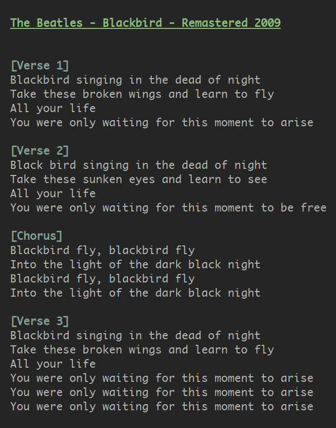

# Current Spotify Song Lyrics

## About

Get the lyrics to the currently playing Spotify song right in your terminal.

## CLI

- `lyrics` to get the currently playing song lyrics
- `lyrics -v` to get the current version
- `lyrics --watch` to stay open and update the lyrics when you get to the next song
  - Alternatively `-w`, `--continuous`, or `-c`
- `lyrics "The Beatles - Blackbird"` for getting lyrics for a specific song
- `lyrics "can't you see im trying"` for finding the song based on it's lyrics

## Support

This script should support Linux, MacOS and Windows. This has however not been tested on Windows and also will not support the color highlighting (feel free to add this in a pull request).

## Installation

Requires Python 3.

Install the packages from the requirement.txt document with pip. Then you can copy the script wherever.
